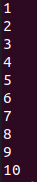

# C and C++ Programming Languages and Exerciese

### Introduction

TBD

### C programming language

TBD

 - code --> object - linker -   exe
 - compile code with gcc 
 
 gcc '/home/ayshine/c_cpp/c/Welcome_C.c' -o '/home/ayshine/c_cpp/c/Welcome'

 - run output 
 
 Drag and drop the output file to terminal and your output will run. 
 
### Introduction to C programming

**A Simple C program: Printing a line of text**
*introduces printf() function*
code:
~~~
/* A first program in C
This program will print out a text "Welcome to C!" */

#include <stdio.h>

/* function main begins program execution */
int main(void)
{
	printf("Welcome to C!\n");

	return 0; /*indicate that program ended successfully*/

} /*end function main*/
~~~

output:

Lines begins with`/*` and  ends with`*/` indicates those lines between are comments. Comments do not cause Computer to perform any action when the program is run.

Line: `#include <stdio.h>` is a directive to the C  **preprocessor**. Lines begins with `#` are processed by the preprocessor before the program is compiled.

Line: `#include <stdio.h>` tells the preprocessor to include the contents of the **standard input/output header (`<stdio.h>`)** in the program. 

Line: `int main(void)` is a part of every C program. The parantheses after `main` indicate that **main** is a program building block called **function**. C programs contain one or more functions, one of which must be `main`. Every program in C begins executing at the function `main` Functions can return information  The keyword `int` to the left of `main` indicates that main "returns" an integer value. Functions also can receive information when they are called upon to execute. The `void` in parantheses here means that `main` does not receive any information. 

Line:  `printf("Welcome to C!\n");` instructs the computer to perform an **action**, namely to print on the screen the **string** of characters marked by he quotation marks. A string issometimes called a **character string**, a **message** or **literal**. The entire line, including `printf`,its **argument** within the parantheses and the **semicolon (; statement terminator)** is called a **statement**.

The characters normally print exactly as they appear between the double quotes in the printf statement. `\n` weren't printed on the screen. The backslash (\) is called **escape character**. It indicates that `printf` is supposed to do something out of the ordinary.  When encountering a backslash in a string, the compiler looks ahead at the next character and combines it with the backslash to form an **escape sequence**. The escape sequence `\n` means **newline**.

|Escape Sequence|Description|
|-----------------------|-------------- |
|\n |Newline.Position the cursor at the begining of the new line.|
|\t |Horizontal tab. Move the cursor to th next tab stop.|
|\a |Alert.Sound the system bell.|
|\\\ |Backslash. Insert a backslash character in a string. |
|\" | Double quote. Insert a double-quote character in a string. |

*Some Common escape sequence*

Line: `return 0;` is included at the end of every `main` function. The keyword `return` is one of several means we will use to **exit a function**. When the `return` statement is used at the end of `main` as shown here, the value 0 indicates that the program has terminated successfully. 

**Another Simple C program: Adding Two integers**
*introduces scanf() function*

code:
~~~
/* Addition Program */
#include <stdio.h>

/*function main begins program execution */
int main( void )
{
	int integer1; /* first number to be input by user */
	int integer2; /* second number to be input by user */
	int sum;      /* variable in which sum will be stored */

	printf("Enter first integer\n"); /* prompt */
	scanf("%d", &integer1);          /* read an integer */

	printf("Enter second integer\n"); /* prompt */
	scanf("%d", &integer2);          /* read an integer */

	sum = integer1 + integer2; /* assign total to sum */

	printf("Sum is %d\n", sum); /* print sum */

	return 0; /* indicate that program ended successfully */

} /* end function main */
~~~

output:

Line: `scanf("%d",&integer1);` is used to obtain a value from the user. The `scanf` reads from the standard  input, which is usually the keyboard. This `scanf` has two arguments, `"%d"` and `&integer1`
The first argument,the **format control string**, indicates the type of data that should be input by the user. The **%d conversion specifier** indicates the type of data that should be an integer. The `%` in this context is treated by scanf as a special that begins a conversion specifier. The second argument of scanf begins with an **ampersand(&)** called the **address operator** in C followed by the variable name. The ampersand, when combined with the variable name, tells scanf the location (or address) in memory at  which the variable **integer1** is stored. The computer then stores the value for **integer1** at that location.

Functions `printf()` and `scanf()` facilitate interaction betweenthe user and the computer. Because this interaction resembles a dialogue, it is often called **conversational comput,ng or interactive computing**.

### Arithmetic in C
The C **arithmetic operators** are summarized in the fugure below.

|C Operation |Arithmetic Operator|Algebraic expression|C Expression|
|-----------------------|-------------- |-----------------------|-------------- |
|Addition |+|$$f+ 7$$| $$f + 7$$ |
|Substraction|-|$$p-c$$| $$p - c$$|
|Multiplication|*|$$bm$$| $$b*m$$|
|Division|/|  $$ x/y$$ or$$  \frac{x}{y}$$ or $$  x ÷ y$$| $$ x/y$$|
|Remainder |%|r  mod  s |r % s |

*Arithmetic Operators*

|Operator(s)|Operation(s)|Order of evaluation (precedence)|
|--------------|-------------- |-----------------------|
|$$()$$ |Parantheses|Evaluated first. If the parentheses are nested, the expression in the innermost pair is evaluated first. If there are several pairs of parantheses "on the same level"(i.e.,not nested)|
|$$*$$|Multiplication| Evaluated second. If there are several, they are evaluated left to right.|
|$$/$$|Division|Evaluated second. If there are several, they are evaluated left to right.|
|$$\%$$|Remainder| |
|$$+$$ |Addition |Evaluated last. If there are several, they are evaluated left to right. |
|$$-$$ |Substraction |Evaluated last. If there are several, they are evaluated left to right.|

*Precedence of arithmetic operators*

### Decision Making: Equality and Relational Operators
Executable C statements either perform **actions** or make **decisions**. We might make decision in a program, for example, to determine if a person's grade on an exam is greater than or equal to 60 and if it is to print the message "Congratulations! You passed." At this point we will talk about a simple version of C's **if statement** that allows a program to make a decision based on the truth or falsity of a statement of fact called **condition**. If the condition is met(i.e.,the condition is **true**) the statement in the body of the if statement is executed. If the condition is not met(i.e.,the condition is **false**) the body statement is not executed. Whether the body statement is executed or not , after the if statementcompletes, execution proceeds with the next statement after the if statement.
Conditions in if statements are formed by using the **equality operators** and **relational operators**. The relational operators all have the same level of predecence and they associate left to right. The equality operators have a lower level of predecence than the relational operators and they also associate left to right.

|Standard algebraic equality operator or relational operator| C equality or relational oerator| Example of C condition| Meaning of C condition|
|--------------------|---------------------|----------------------|----------------------------|
*Equality operators*
|=|==|x==y|x is equal to y|
|≠| !=| x != y | x is not equal to y |
*Relational operators*
|>| >| x > y| x is greater than y|
|<|<| x< y| x is less than y|
|≥| >=| x >= y| x greater than or equal to y|
|≤| <=| x <= y| x is less than or equal to y|

 *Equality and relational operators*

Equality operator (==) can be confused with the assignment operator(=). To avoid this confusion, the equality operator should be read "double equals" and the assignment operator should be read "gets". 

**A Simple C program:Operators**
*Using if statements, relational operators, and equality operators*

code:
~~~
/* Using if statements, relational
   operators, ans equality operators */

#include <stdio.h>

/* function main begins program execution */

int main(void)
{
	int num1; /* first number to be read from user */
	int num2; /* second number to be read from user */

	printf("Enter two integers, and I will tell you\n");
	printf("the relationships they satisfy: ");

	scanf("%d%d",&num1, &num2); /*read two integers*/

	if (num1 == num2){
		printf("%d is not equal to %d\n", num1, num2);
	}/*end if*/

	if (num1 != num2){
		printf("%d is not equal to %d\n", num1, num2);
	}/*end if*/

	if (num1 < num2){
		printf("%d is less than %d\n", num1, num2);
	}/*end if*/

	if (num1 > num2){
		printf("%d is greater than %d\n", num1, num2);
	}/*end if*/

	if (num1 <= num2){
		printf("%d is less than or equal to %d\n", num1, num2);
	}/*end if*/

	if (num1 >= num2){
		printf("%d is greater than or equal to %d\n", num1, num2);
	}/*end if*/

	return 0; /*indicate that program ended successfully*/

}/*end function main*/
~~~
output:

|Operators| Associativity|
|--------|-------|
|()|left to right|
|*	/	%|left to right|
|+	-left to right|
|<	<=	>	>=|left to right|
|==	 	!=|left to right|
|=|left to right|

*Precedence and associativity of the operators discussed so far*

|Keywords||||
|-----|------|------|----|
|auto|double|int|struct|
|break|else|long|switch|
|case|enum|register|typedef|
|char|extern|return|union|
|const|float|short|unsigned|
|continue|for|signed|void|
|default|goto|sizeof|volatile|
|do|if|static|while|

*C's keywords*

C keywords have special meaning to the C compiler, so you must be careful not to use these as identifiers such as variable names.

### Structured Program Development in C

#### Algorithms
The solution to any computing problem involves executing a series of actions in a specific order. A **procedure** for solving a problem in terms of

- the **actions** to be executed, and
- the **order** in which these actions are to e executed 

is called an **algorithm**. Specifying the order in which statements are to be executed in a computer program is called **program control**.

#### Pseudocode
**Pseudocode** is an artificial and informal language that help you develop algorithms. Pseudocode is similar to everyday English.Pseudocode programs are not executed on computers. Rather, they merely help you "think out"a program before attempting to write it in a programming language such as C. Pseudocode consists only of action statements.

#### Control Structures
Normally, statements in a program are executed one after the other in the order in which they are written. This is called **sequential execution**. Various C statements enable you to specify that the next statement to be executed may be other than the next in sequence. This is called **transfer of control**.

The sequence structure is essentially built into C. Unless directed otherwise , the computer automatically executes C statements one after the other in the order which they are written.

A **flowchart** is a graphical representation of an algorithm or of a portion of an algorithm. Flowcharts aredrawn using certain special-purpose symbols such as rectangles, diamonds, ovals, and small circles; these symbols are connected by arrows called flowlines.
When drawing a flowchart that represents a complete algorithm, an oval symbol containing the word "Begin" is the first symbol used in the flowchart; an oval symbol containing the word "End" is the last symbol used. Perhaps the most important flowcharting symbol is the **diamond symbol** also called the **decision symbol**, which indicates that a decision is to be made.

C provides three types of selection structures in the form of statements. The if selection statement either performs an action if a condition is true or skips the action if the condition is false. The if...else selection statement performs an action if a condition is true and performs a different action if the condition is false. The switch selection statement performs one of many different actions depending on the value of an expression. The if statement is called a **single-selection statement** because it selects or ignores a single action. The if...else statement is called a **double-selection statement**  because it selects between two different actions. 

C provides three types of repetition structures in the form of statements, namely while, do...while, and for. 

#### The *if* Selection Statement
Selection structures are used to choose among alternative courses of action. For example, suppose the passing grade on an exam is 60. The pseudocode statement

> *If Student's grade is greater than or equal to 60*
>>*Print "Passed"*

Determines if the condition "student's grade is greater than or equal to 60"  is true or false. If the condition is true, then "Passed" is printed , and the next pseudocode statement in order is "performed". If the condition is false printing is ignored, and the next pseudocode statement in order is performed.

The preceding pseudocode *If* statement may be written in C as 

~~~
if ( grade >= 60 ){
	printf( "Passed\n" );
}
~~~

#### The *if...else* Selection Statement
The *if...else* selection statement allows you to specify that different actions are to be performed when the condition is true than when the condition is false. For example, the  pseudocode statement 

>*If student's grade is greater than or equal to 60*
>>*Print "Passed"*

> *else*
>> *Print "Failed"*

prints *Passed* if the student's grade is greater than or equal to 60 and prints *Failed*  if the student's grade is less than 60. In either case, after printing occurs, the next pseudocode statement in the sequence is "performed."

The preceding pseudocode *If...else* statement may be written in C as

~~~
if ( grade >= 60 )
{
	printf( "Passed\n" );
}
else
{
	printf( "Failed!\n" );
}
~~~

C provides the conditional operator (?:) which is closely related to the *if...else* statement. The conditional operator is C's only **ternary operator**. The operands together with the conditional operator form a conditional expression. The first operand is a condition. The second operand is the value for the entire conditional expression if the condition is true and the third operand is the value for the entire conditional expression if the condition is false. For example the printf statement 

~~~
printf( "%s\n", grade >= 60 ? "Passed" : "Failed" ); 
~~~

**Nested *if..else* statements** test for multiple cases by placing if...else statements inside if...else statements. Many programmers prefer to write *if...else if...else* statements instead of using nested if..else statements. 

#### The *while* Repetition Statements
A **repetition statement** allows you to specify that an action is to be repeated while some condition remains true. The pseudocode statement

>*While there are more items on my shopping list*
>>*Purchase next item and cross it off my list*
 
describes the repetition that occurs during a shopping trip. The condition, "there are more items on my shopping list" may be true or false. If it is true, then the action "Purchase next item and cross it off my list" is performed. This action will be performed repeatedly while the condition remains true. Eventually, the condition become false. At this point, the repetition terminates, and the first pseudocode statement after the repetition structure is executed.

***Note:*** Counter-controlled repetition is often called *definite repetition* because the number of repetitions is known before the loop begins executing.

Here are some examples and outputs:

- [Class Average Code](c/Average.c) 

- [Class Average with Sentinel](c/Average_sentinel.c)

- [Examination (Calculates overall passes and fails)](c/Examination.c)

#### Assignment Operators
C provides several assignment operators for abbreviating assignment expressions. For example thestatement `c = c + 3` can be abbreviated with the **addition assignment operator** `+=` as `c += 3;`

Any statement of the form;
 ***variable = variable operator expression;***
where **operator** is one of the binary operators +, -, *, / or % can be written in the form;
 ***variable operator= expression;***
 C also provides unary **increment operator**, ++ and the unary **decrement operator** --.
 
 |Assignment operator| Sample expression| Explanation|Assigns|
 |---------------------|----------------------|-------------------|-------------------|
 *Assume:* **int** c = 3, d = 5, e = 4, f = 6, g = 12
 |`+=`| `c += 7`| `c = c + 7`| 10 to c| 
 |`-=`| `d -= 4`| `d = d - 4`| 1 to c| 
 |`*=`| `e *= 5`| `e = e * 5`| 20 to e| 
 |`/=`| `f /= 3`| `f = f / 3`| 2 to f| 
 |`%=`| `g %= 9`| `g = g % 9`| 3 to g| 

*Arithmetic assignment operators*

|Operator|Sample Expression|Explanation|
|--------------------|-----------------------|-------------------|
|`++`| `++a`| Increment a by 1, then use the new value of a in the expression in which resides.|
|`++`|`a++`|Use the current value of a in the expression in which a resides, then increment a by 1|
|`--`|`--b`|Decrement b by 1, then use the new value of b in the expression in which b resides|
|`--`|`b--`|Use the current value of b in the expression in which b resides, then decrement b by 1|

*Increment and decrement operators*

[Preincrement postincrement Example](c/Pre_post_increment.c) 

|Operators|Associativity|Type|
|-------------|----------------|------|
|`++(postfix)`		`--(postfix)`|  right to left| postfix|
|`+`		`-`		`(type)`		`++(prefix)`		`--(prefix)`|right to left| unary|
|`*`		`/`		`%`|left to right|multiplicative|
|`+		-`|left to right|additive|
|`<`	`<=`	`>`	`>=`|left to right|relational|
|`==`		`!=`|left to right|equality|
|`?:`|right to left|conditional|
|`=`	`+=`	`-=`	`*=`	`/=`	`%=`|right to left|assignment|

*Precedence and associativity of the operators encountered so far in the text*

### C Program Control

#### Repetition Essentials
Most programs involve repetition, or **looping**. A **loop** is a group of intructions the computer executes repeatedly while some **loop-continuation condition** remains true. We have discussed two means of repetition:

-  Counter-conrolled repetition
-  Sentinel-conrolled repetition

Counter-controlled repetition is sometimes called **definite repetition** because we know in advance exactly how many times the loop will be executed.Sentinel-controlled repetition is sometimes called **indefinite repetition** because it is not  known in advance how many times the loop will be executed.

In counter-controlled repetition, a **control variable** is used to count the number of repetitions. The control variable is incremented (usually by 1) each time the group of instructions is performed. When the value of control variable indicates that the correct number of repetitions has been performed, the loop terminates and the computer continues executing with the statement after the repetition statement.

Sentinel values are used to control repetition when:

- The precise number of repetitions is not known in advance, and
- The loop includes statements that obtain data each time the loop is performed.

#### Counter-Controlled Repetition
Counter-control repetition requires:
- The **name** of a control variable(or loop counter)
- The **initial value** of the control variable.
- The **increment** (or **decrement**) by which the control variable is modified each time through the loop.
- The condition that tests for the **final value** of the control variable

[counter control repetition example](c/cc_repetition.c)
output: 

***Note:*** Too many levels of nesting can make a program difficult to understand. As a general rule, try to avoid using more than three levels of nesting.

#### *for* Repetition Statement 
The for repetition statement handles all the details of counter-controlled repetition. We can rewrite counter control repetition example using for instead of while. 

[counter control repetition example with for](c/cc_for_repetition.c)
output:

~~~c
    for ( counter = 1; counter <= 10; counter++ ) {
        printf( "%d\n", counter ); /* display counter */
    } /* end for */
~~~

When the for statement begins executing, the control variable counter is initialized to 1 with `counter = 1` expression. Then, the loop-continuation condition `counter <= 10` is checked. Because the initial value of counter is 1, the condition is satisfied, so the printf statement prints the value of counter, namely 1. The control variable counter is then incremented by the expression counter++, and the loop begins again with the loop-continuation test. Since the control variable is now equal to 2, the final value is not exceeded, so the program performs the printf statement This process continues untill the control variable counter is incremented to its final value of 11 which causes the loop-continuation test to fail , and repetition terminates.

The expressions in the for statement are optional. If *expression2* isomitted, C assumes that the condition is true, thus creating an infinite loop. One may omit *expression1* if the control variable is initialized elsewhere in the program. *expression3* may be omitted if the increment is calculated by statements in the body of the for statement of if no incrementis needed. The increment expression in the for statement acts like a stand-alone C statement at the end of the body of the for.

**Example Uses of *for* Statement**
**1.** Vary the control variable from 1 to 100 in increments of 1.
`for ( i = 1; i <= 100; i++ )`
**2.** Vary thecontrol variable from 100 to 1 in increments of -1 (decrements of 1)
`for ( i = 100; i >= 1; i--)`
**3.** Vary the control variable from 7 to 77 in steps of 7.
`for ( i = 7; i <= 77; i += 7 )`
**4.** Vary the control variable from 20 to 2 in steps of -2.
`for ( i = 20; i >= 2; i -= 2 )`
**5.** Vary the control variable over the following sequence of values: 2, 5, 8, 11, 14, 17, 20
`for ( j = 2; j <= 20; j += 3 )`
**6.** Vary the control variable over the following sequence of values: 99, 88, 77, 66, 55, 44, 33, 22, 11, 0.
`for ( j = 99; j >= 0; j -= 11 )`
#### *switch* Multiple-Selection Statement
Occasionally, an algorithm will contain a series of decisions in which a varialbe or expression is tested seperately for each of the constant integral values it may assume, and different actions are taken. This is called multiple selection. C provides the **switch** multiple-selection statement to handle such decision making.

The switch statement consists of a series of case labels and an optional default case. The following example uses switch to count the number of each different letter grade students earned on an exam.

(EOF Character I used to terminate switch is `ctrl + D` because I use linux os system . Windows operating system uses `ctrl + Z` as EOF character)

[Counting lettergrades Example](c/Counting_letter_grades.c)
output:

When using switch statement, remember that it can be used only for testing a **constant integral expression** (i.e, any combination of character constants and integer constants that evaluates to a constant integer value.)

#### *do...while* Repetition Statement

The *do...while* repetition statement is similar to the *while* statement. In the *while* statement, the loop-continuation condition is tested at the begining of the loop before the *body* of the loop is performed. The *do...while* statement tests the loop-continuation condition *after* the loop body is performed. Therefore, the loop body is executed at least once. When a *do...while* terminates, execution continues with the statement after the while clause.

~~~
do
	statements
	while( condition );
do{
	statements
	}while( condition );
~~~

[*do..while* example](c/do_while.c)

#### *break* and *continue* Statements
The **break** and **continue** statements are used to alter the flow control. The break statement when executed in a while, for, do...while or switch statement, cause an immediate exit from the statement. Program execution continues with the next statement.Common uses of the break statement ate to escape early from a loop or to skip the remainder of switch statement.

The continue statement, when executed in a while , for or do...while statement, skips the remaining statements in the body of that control statement and performs the next iteration of the loop. In while and do...while statements, the loop-continuation test is evaluated immediately after the continue statement is executed. In the for statement, the increment expression is executed, then the loop continuation test is evaluated.

[Break statement example with for](c/break_for.c)

[Continue statement example with for](c/continue_for.c)

#### Logical Operators 
C provides **logical operators** that may be used to form more complex conditions by combining simple conditions. The logical operators are **&&(logical AND)**, **||(logical OR)** and **! (logical NOT)** also called **logical negation**. 
Suppose we wish to ensure that two conditions are *both* true before we choose a certain path of execution. In this case, we can use the logical operator **&&** as follows:
~~~
	if ( gender == 1 && age >= 65)
		++seniorFemales;
~~~
Suppose we wish to ensure atsome point in a program that either *or* both of two conditions are true before we choose a certainpath of execution. In this case, we use the **||** operator as in the following program segment:
~~~
	if ( semesterAverage >= 90 || finalExam >= 90 )
		printf( "Student grade is A\n" );
~~~
C provides !(logical negation) to enable a programmer to "reverse" the meaning of a condition. The logical negation operator is placed before a condition when we are interested in choosing a path of execution if the original condition is false, such as in the following program segment:

~~~
if ( !( grade == sentinelValue ) )
	printf( "The next grade is %f\n", grade );
~~~
The follwing  tables are truth tables for logical operators.

|Expression1|Expression2|Expression1 `&&` Expression2|
|--------------------|-----------------------|-------------------|
|0|0|0|
|0|nonzero|0|
|nonzero|0|0|
|nonzero|nonzero|0|

*Truth table for the **&&**(logical AND) operator*

|Expression1|Expression2|Expression1 `||` Expression2|
|--------------------|-----------------------|-------------------|
|0|0|0|
|0|nonzero|1|
|nonzero|0|1|
|nonzero|nonzero|1|

*Truth table for the **||**(logical OR) operator*

Expression1|! Expression1|
|--------------------|-----------------------|
|0|1|
|nonzero|0|

*Truth table for the **!**(logical negation) operator*

### C Functions

#### Program Modules in C
Modules in C are called **functions**. C programs are typically written by combining new functions you write with "prepackaged" functions available in the **C Standard Library**. Functions are **invoked** by a **function call**, which specifies the function name and provides information (as **arguments**) that the called function needs in order to perform its designated task.

#### Functions
Functions allow you to modularize a program. All variables defined in function definitions are **local variables** they are known only in the function in which they are defined. Most functions have a list of **parameters**. The parameters provide the means for communicating information between functions. A function's parameters are also local variables of that function.

#### Function Definitions
Each program we present has consisted of a function called main that called standard library functions to accoplish its tasks. We now consider how to write custom functions. Consider a program that uses a function square to calculate and print the squares of the integers from 1 to 10.

[Programmer defined function example](c/function.c)

In the example above , we used the line below before main function

~~~c
int square( int y );  /* function prototype */
~~~
 which is a **function prototype** The in parantheses informs the compiler that square expects to receive an integer value from the caller. The compiler refersto the function prototype to check that calls to square contain the correct retrn type, the correct number of arguments, the correct argument types, and that the arguments are in the correct order.
 
 Function square is **invoked** or **called** in main within the printf statement
~~~c
printf( "%d ", square( x ) ); /* display value of x */
~~~
Function square receives a copy of the value of x in the **parameter** y.  Then square calculates `y * y`. The result is passed back to function 
printf in the main where square was invoked, and printf displays the result.

The format of a function definition is 

~~~c
return-value-type function-name( parameter-list )
{
	definitions
	statements
}
~~~
the *function-name* is a vald identifier. The **return-value type** is the data type of the result returned to the caller. The *return-value-type* void indicates that a function does not return a value. An unspecified *return-value-type* is assumed by the compiler to be int. However, omitting the return type is discouraged. Together, the *return-value-type*, *function-name* and *parameter-list- are sometimes referred to as the **function header**.

The **parameter-list** is a comma seperated list that specifies the parameters received by the function when it is called. If a function does not receive any values, *parameter-list* is void. A type must be listed explicitly for each parameter unless the parameter is of type int. If a type is not listed, int is assumed.

~~~c
/* square function definition returns square of parameters */
int square( int y ) /* y is a copy of argument to function */
{
    return y * y; /* returns square of y as an int */
} /* end of function square */

~~~

There are three ways to return from a called function to the point at which a function was invoked. IF the function does not return a result, control is returned simply when the function-ending right brace is reached, or by executing the statement `return;`. If the function does return a result, the statement `return expression;` returns the value of *expression* to the caller. 

[Programmer defined function example2](c/maximum.c)

 
#### Function Prototypes
A function prototype tells the compiler the type of data returned by the function, the number of paramaters the function expects to receive, the types of parametrs, and the order which these parameters are expected. The compiler uses function prototypes to validate function calls.
The function prototype for the latest example function maximum is 

~~~c
int maximum( int x, int y, int z );  /* function prototype */
~~~

This function prototype states that maximum takes three arguments of type int and returns a result of type int. Notice that the function prototype is the same as the first line of function definition of maximum.
A function call that does not match the function prototype is asyntax error. An error is also generated if the function prototype and the function definition disagree.
Another imprtant feature of function prototypes is the **coercion of arguments**, i.e., the forcing of arguments to the appropriate type. For example, the math library function sqrt can be called with an integer argument even though the function prototype in <math.h> specifies a double argument, and the function will still work correctly.
The statement `printf( "%.3f\n", sqrt( 4 ) );` correctly evaluates sqrt( 4 ), and prints the value 2.000. The function prototype causes compiler to convert the integer value 4 to the double value 4.0 before the value is passed to sqrt.

|Data Type|printf conversion specfication|scanf conversion specification|
|-------------------------|---------------------------|---------------------------------|
|long double|%Lf|%Lf|
|double|%f|%lf|
|float|%f|%f|
|unsigned long int|%lu|%lu|
|long int|%ld|%ld|
|unsigned int|%u|%u|
|int|%d|%d|
|unsigned short|%hu|%hu|
|short|%hd|%hd|
|char|%c|%c|

*Promotion hierarchy for data types*

#### Function Call Stack and Activation Records

To understand how C performs function calls, we first need to consider a data structure known as stack. Stacks are known as **last-in, first out (LIFO) data structures** the last item pushed(inserted) on the stackis the first item popped (removed) from the stack.

When a program call a function, the called function must know how to return to its caller, so the return address of the calling functionis pushed onto the **program execution stack (function call stack)** If a series of function calls occurs, the successive return addresses are pushed onto the stack in last-in first-out order so that each function can return to its caller.

The program execution stack also contains the memory for the local variables used in each invocation of a function during a program's execution. This data, stored as a portion of the program execution stack, is known as the **activation record** or **stack frame** of the function call. When a function call is made, the activation record for that function call is pushed onto the program execution stack. When the function returns to its caller, the activation record for this function call is popped off the stack and those local variables are no longer known to the program. If a local variable holding a reference to an object  is the only variable in the program with a reference to that object, when the activation record containing that local variable is popped off the stack, the object can no longerbe accessed by the program and will eventually be deleted from memory by the JVM during "garbage collection." 

Of course, the amount of memory in a computer is finite, so only a certain amount of memory can be used to store activation records on the program execution stack. If more function calls occur than can have their activation records stored on the program execution stack, an error known as a **stack overflow** occurs.

#### Headers
Each standard library has a corresponding **header** containing the function prototypes for all the functions in that library and definitions of various data types and constants needed by those functions. Headers can be included by using `#include` preprocessor directive.

#### Calling Functions: Call-by-Value and Call-by-Reference
There are two ways to invoke functions in many programming languages **called-by-value** and **called-by-reference**. When arguments are passed by value, a *copy* of the argument's value is made and passed to the called function. Changes to the copy do not affect an original variable's value in the caller. When an argument passed by reference , the caller allows the called function to modify the original variable's value.

Some Examples
-  [Random number generator](c/random.c)

-  [Roll a six sided die 6000 times](c/sixsideddie.c)

- [Randomized die roll](c/randomizedroll.c)

***note:*** to randomize without entering a seed each time, use a statement like `strand( time( NULL ) );`

- [A Game of Chance: Craps](c/craps.c)

#### Storage Classes 

Each identifier (name for user-defined functions) in a program has other attiributes, including **storage class, storage duration, scope** and **linkage**.
C provides four storage classes, indicated by the **storage class specifiers: auto, register, extern** and **static**. An identifier's **storage class** determines its storage duration, scope and linkage. An identifier's **storage duration** is the period during which the identifier exists in memory. Some exists briefly, some are repeatedly created and destroyed , and others exist for the entire execution of a program. Some can be referenced throughout a program, others from only portions of a program. An identifier's  **linkage** determines for a multiple-source-file program whether the identifier is known only in the current source file or in any source file with proper declerations. 
The four storage class specifiers can be split into two storag durations:  **automatic storage duration** and  **static storage duration**. Keywords `auto` and `register` are used to declare variables of automatic storage duration. Variables with automatic storage duration are created when the block in which they are defined is entered; they exist while the block is active, and they are destroyed when the block is exited.

Only variables can have automatic storage duration. A function's local variables normally have automatic storage duration. Keyword `auto` explicitly declares variables of automatic storage duration.

Data in the machine-language version of a program is normally loaded into registers for calculations and other processing. The compiler may ignore register declerations. The following decleration suggests that the integer variable counter be placed in one of the computer's registers and initialize to 1: `register int counter = 1;`
Keywords `extern` and `static` are used in the declarations of identifiers for variables and functions of static duration. Identifiers of static duration exist from the time at which the program being execution. For static variables, storage is allocated and initialized once, when the program begins execution. For functions, the name of the function exists when the program begins execution.

#### Scope Rules
The **scope** of an identifier  is the portion of the program in which the identifier can be referenced. 

#### Recursion
A **recursive function** is a function that calls itself either directly or indirectly through another function.

Recursive function examples : 
- [Factorial](c/factorial.c)

- [Fibonacci](c/fibonacci.c)

### C Arrays

An array is a group of memory locations related by the fact that they all have the same name and the same type. To refer to a particular location or element in the array, we specify the name of the array and the **position numer** of the particular element in the array.

The first element in every array is the **zeroth element**. Thus,the first element of an array named c is referred to as c[0].In general, *i*th element of array c is referred to as c[i-1]. Array names, like other variable names, can contain only letters, digits and underscores. Array names cannot begin with a digit.

The position number contained within square brackets is more formally called a **subscript(index)**. A subscript must be an integer or an integer expression. If a program uses an expression as a subscript, then the expression is evaluated to determine the subscript, then the expression is evaluated to determine the subscript.

#### Defining Arrays 
Arrays occupy space in memory. You specify the type of each element and the number of elements required by each array so that the computer may reserve the appropriate amount of memory. To tell the computer to reserve 12 elements for integer array c, the definition `int c[12];` is used. The following definition `int b[ 100 ], x[ 27 ];` reserves 100 elements for integer array b and 27 elements for integer array x.

The elements of an array can also be initialized when the array is defiend by following the definition with an equals sign and braces, {}, containing a comma-seperated list of **initializers**.

[Array initialize Example](c/array1.c)

[Array Initialize with Definition Example](c/array2.c)

`int n[ 10 ]  = { 0 };` explicitly initializes the first element to zero and initializes the remaining nine elements to zero because there are fewer initializers than thee are elements in the array. This method of initializing the array element to zero is performed at compile time for static arrays and runtime for automatic arrays.

If the array size is omitted from a definition with an initializer list, the number of elements in the array will be the number of elements in the initializer list. For example, `int n[] = { 1, 2, 3, 4, 5 };` would create five-element array.
Name of the array is a symbolic constant that represents array's starting address and isnot an object.

***note:*** Symbolic constants can be defied using `#define` preprocessor directive.

***Using Character Arrays to Store and Manipulate Strings***

A character array can be initialized using a string literal. For example, `char string1[] = "first";` initializes the elements of array string1 to the individual characters in the string literal "first". It is important to note that string "first" contains five characters *plus* aspecial string-termination character called the **null character**. Thus array string1 actually contains isx elements. The character constant representing the null character is '\0'. All strings in C end with this character. A character array representing a string should always be defined large enough to hold the number of characters in the string and the terminating null character. Character arrays also can be initialized with individual character constants in an initializer list. The preceding definition is equivalent to 
~~~
char string1[] = { 'f', 'i', 'r', 's', 't', '\0' };
~~~
 
Because a string is really an array of characters, we can access individual characters in a string directly using array subscription notation. Fro example, string1[0] is the character 'f' and string1[3] is the character 's'.

[Char Array](c/char_array.c)

***no te:*** Arrays that are static are automatically initialized once at a compile time. If you do not explicitly initialize a static array, that array's elements are initialized to zero by the compiler.

#### Passing Arrays to Functions
T pass an array argument to a function, specfy the name of the array without any brackets. For example, if array hourlyTemperatures has been defined as 
~~~
int hourlyTemperatures[ 24 ];
~~~
the function call
~~~
modifyArray(hourlyTemperatures, 24)
~~~
passes array hourlyTemperatures and its size to function modifyArray. C automatically passes arrays to functions by reference - the called function can modify the element values in the callers' original arrays. The name of the array evaluates to the address of the first element of the array. Because the starting address of the array is passed, the called function knows precisely where the array is stored. Therefore, when the called function modifies array elements in its function body, it is modifying the actual elements in its function body, it is modifying the actual elements of the array in their original memory locations.

*Passing arrays by reference makes sense for performance reasons. If arrays were passed by value, a copy of each element would be passed. For large, frequently passed arrays, this would be time consuming and would consume considerable storage for copies of the array.

[Printing an array name](c/array_name.c)

[Passing Arrays and individual array elements](c/passing_arrays.c)

#### Multiple Scripted Arrays
Arrays in C have multiple subscripts. A common use of multiple-subscripted arrays is to represent **tables** of values consisting of information arranged in **rows** and **columns**. To identify a particular table element, we must specify two subscripts: The first (by convention) identifies th element's row and the second (by convention) identifies the element's column. Tables or arrays that require two subscripts to identify a particular element are called **double-subscripted arrays**. Note that multiple subscripted arrays can have more than two subscripts. In general, an array with *m* rows and *n* columns is called an *m-by-n array*.
A multiple -subscripted array can be initialized when it is defined, much like a single-subscripted array. For example, a double-subscripted array `int b[ 2 ][ 2 ]` could be defined and initialized with 

~~~
int b[ 2 ][ 2 ] = { { 1, 2 }, { 3, 4 } };
~~~ 

[Initializing multidimensional arrays](c/multi_dim_array.c)

### C Pointers

#### Pointer Variable Definitions and Initialization
Pointers are variables whose values are memory addresses. Normally, a variable directly contains aspecific value. A pointer, on the other hand, contains an address of a variable that contains a specific value. Referencing a value through a pointer is called **indirection**. Pointers like all variables, must be defined before they can be used. The definition
~~~
int *countPtr, count;
~~~
specifies that variable countPtr is of type **int ***(i.e., a pointer to an integer) and is read, "countPtr is a pointer to int" or "countPtr points to an object of type int." Also, the variable count is defined to be an int, not a pointer to an int. The * only applies to countPtr in the definition. When * is used in this manner in a definition, it indicates that the variable being defined is a pointer. Pointers can be defined to point to objects of any type.

Pointers should be initialized either when they are defined or in an assignment statement. A pointer may be initialized to 0, NULL or an address. A pointer with the value NULL points to nothing. NULL is a symbolic constant defined in the <stddef.h> header. Initializing a pointer to 0 is equivalent to initializing a pointer to NULL, but NULL ispreferred. When 0 is assigned, it is first converted to a pointer of the appropriate type. The value 0 is the only integer value that can be assigned directly to a pointer variable.

####Pointer Operators

####Passing Arguments to Functions by Reference

####Using *const* Qualifier with Pointers

####sizeof Operator

####Pointer Expression and Pointer Arithmetic

####Relationship between Pointers and Arrays

####Arrays of Pointers

####Pointers to Functions

vmvmvmvson

